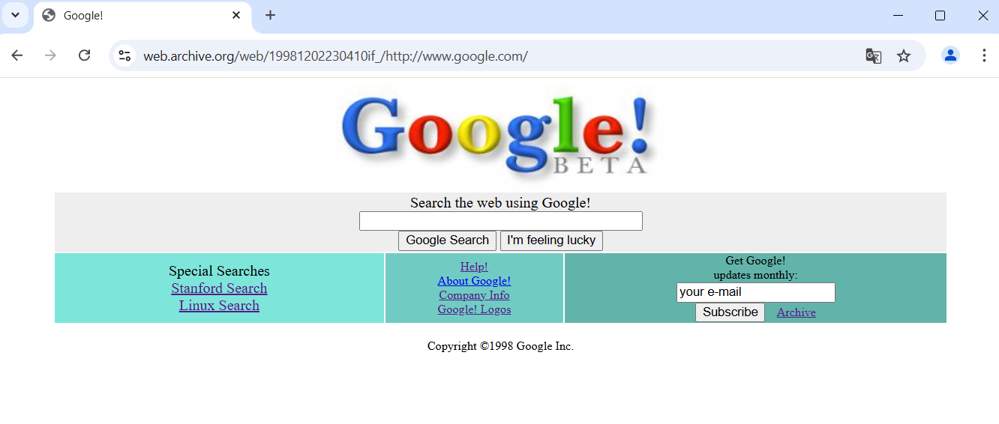
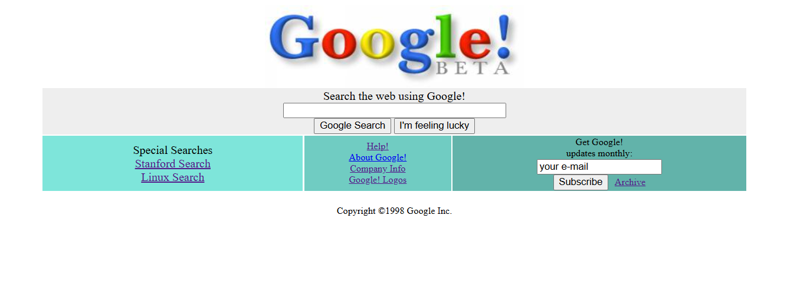

# Google 1998 Homepage Clone

## Description

A simple **Google homepage clone** as it appeared in **1998**.

It uses basic HTML and CSS to recreate the look and feel of the original site, offering a nostalgic glimpse into the early days of Google.

---

## Screenshot

Here is a comparison of the original and the clone.

|            **Original Google Homepage from 1998**            |
| :----------------------------------------------------------: |
|  |

|              **Google 1998 Homepage Clone**               |
| :-------------------------------------------------------: |
|  |

The top image shows the design and layout of Google’s homepage as it appeared in 1998. You can view the original page [here](https://web.archive.org/web/19981202230410if_/http://www.google.com/) for reference.

The bottom image is a clone that I created using HTML and CSS, aiming to capture the look and feel of the original site. The two images are compared to showcase the similarities and differences in design.
